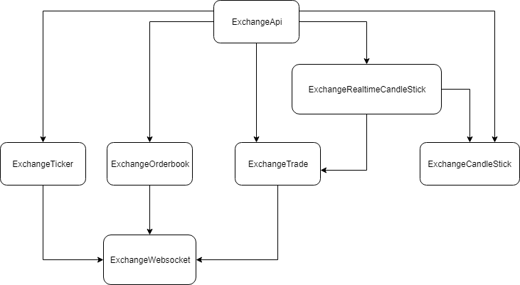

# -----This is currently under development-----
# ccex-api
cryptocurrency exchanges client api wrapper

# Features
These features are supported with all major exchanges
- Public realtime api
- Public rest api
- Support for both Nodejs and Browser environments
- Modular structure make sure you include minimum code as you need (exspecially for client side application)
- Option to bypass cors request problem in browser with [proxy](https://github.com/Rob--W/cors-anywhere)
- More to come: Tradingview datafeed, private rest api with api key...

# Modular structure
This sample of one way dependencies diagram demonstrates how modules are structured and combined. This may differentiated from one exchange to another.

<p align="center"></p>

When you include a module you also include all of its dependencies

# Supported Exchanges
Bitbank, Binance, Bitfinex, Coinbase (Gdax), Coincheck...

# Usage
This library is designed to be usable in both nodejs and browser (with frontend framework like Angular, React, Vue,... The umd javascript file coming later) environments. When used in browser environment, the browser must support for native [fetch](https://developer.mozilla.org/en-US/docs/Web/API/Fetch_API/Using_Fetch) and [websocket](https://developer.mozilla.org/en-US/docs/Web/API/WebSocket)
## Installation
```
npm i --save ccex-api
```

## Simple use
```
import { BitbankApi } from 'ccex-api/exchanges/bitbank;

const bitbankApi = new BitbankApi();

bitbankApi.fetchTicker$('btc_jpy').subscribe(ticker => console.log(ticker));
bitbankApi.ticker$('btc_jpy').subscribe(ticker => console.log(ticker));
setTimeout(() => { bitbankApi.stopTicker('btc_jpy') }, 5000);
```

Or you can include only the part that you need
```
import { BitbankCandlestick } from 'ccex-api/exchanges/bitbank/candlestick;

const bitbankCandlestick = new BitbankCandlestick();
bitbankCandlestick.getApproximateHistoryPrice('btc_jpy', 1526917534904, 1).subscribe(price => console.log(price));
```

# Api
Basically all exchanges have these following api implemented.

|api|params|return value | desctiption |
---|---|---|---
exchangeInfo| | ExchangeInfo | |
markets| | string[] | |
representativeMarkets| | string[] | |
supportFeatures| | SupportFeatures | |
fetchTicker$| pair: string | Observable\<Ticker> | api request for ticker |
ticker$| pair: string | Observable\<Ticker> | realtime ticker stream |
stopTicker| | | stop realtime ticker stream |
fetchTrades$| pair: string | Observable\<Trade> | api request for trade |
trade$| pair: string | Observable\<Trade> | realtime trade stream |
stopTrade| | | stop realtime trade stream |
fetchOrderbook$| pair: string | Observable\<Orderbook> | api request for orderbook |
orderbook$| pair: string | Observable\<Orderbook> | realtime orderbook stream |
stopOrderbook| | | stop realtime orderbook stream |
fetchCandleStickRange$| pair: string <br> minutesFoot: number <br> start: number <br> end: number| Observable<CandleStick[]> | api request for candlestick |
lastCandle$| pair: string <br> minutesFoot: number <br> lastCandle: CandleStick | Observable\<CandleStick> | Realtime candlestick stream, calculated from an initial lastCandle and realtime trade stream. <br> This function is useful in implementing Tradingview datafeed |

Besides, an exchange may have more specific functions. It depends on exchange provided features and implementation.
In that case, it is good to have specific guide for that exchange located at `exchanges/{exchange}/README.md`

# Contributor guide
In order to add a new exchange, simply clone folder `src/exchanges/sample`, rename, implement functions and include appropiate tests for sub-modules (ticker, orderbook...) and some internal functions

Finally make sure the exchange `sample` pass our predefined test by running

```
npm run main-test --exchange sample
```

# Test
main test: test for main module which implement the above interface directly
```
npm run main-test
```

sub test: test for sub-modules used inside main module and its internal functions
```
npm run sub-test
```

# Dependencies
This library is built strongly on top of Rxjs (v6 or above)
- [Rxjs](https://github.com/ReactiveX/rxjs)
- [node-fetch](https://github.com/bitinn/node-fetch) (nodejs env only)
- [ws](https://github.com/websockets/ws) (nodejs)
